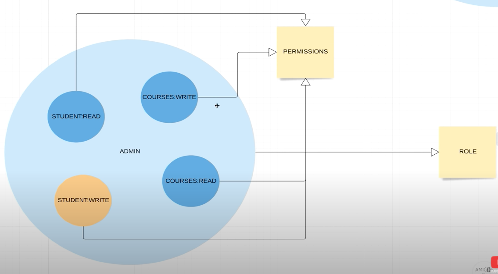
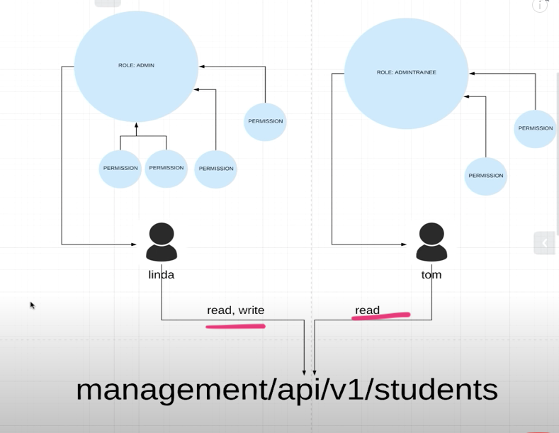
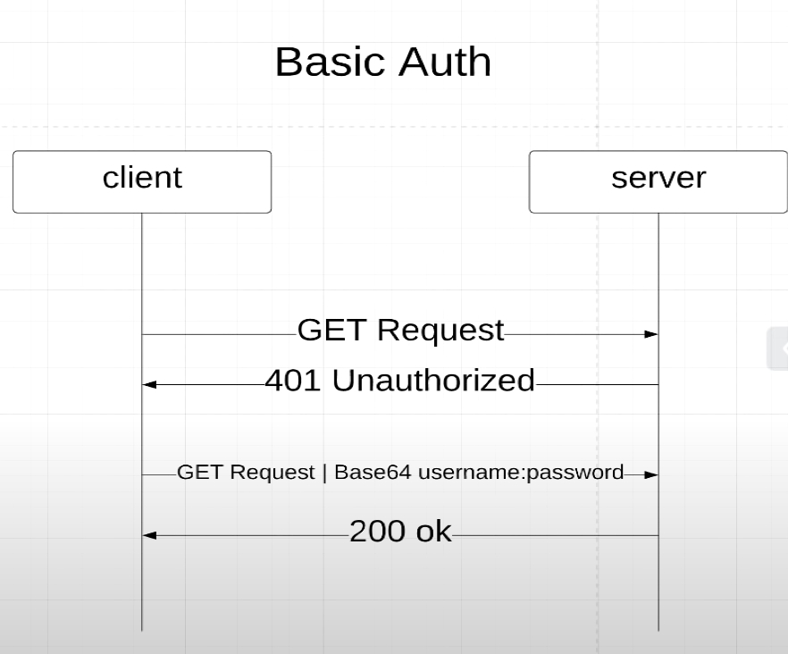
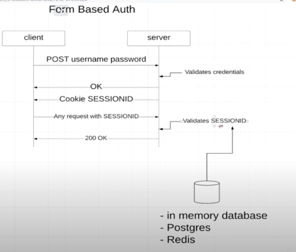
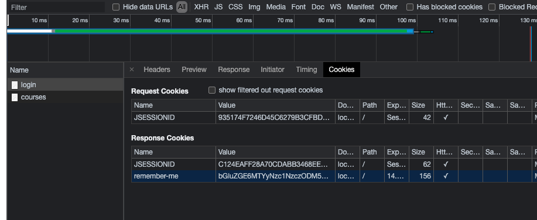

# Spring boot Maven Plugin 

## References 
*  Simple Introduction : https://www.javalopment.com/2019/04/configuring-spring-boot-application.html
*  Complete Reference : https://docs.spring.io/spring-boot/docs/current/maven-plugin/reference/htmlsingle/#?.?
*  https://www.youtube.com/watch?v=her_7pa0vrg


## Bare Minimum 
1. Autogenerated Log in page 
````
localhost:8080/login
````
2. Autogenerated log out page 
````
localhost:8080/logout
````


## Basic Authentication with SPring Boot


Basic auth needs to send credentials in every call; so it is best suited for external communication 

* with web browser you will see an input box for the credentials 
* this is not a good approach for application ; so application can pass the following header 
````
Authorize : Basic base64(username:password)
```` 
example value  `Basic dXNlcjphYmMxMjM=`

In Postman


## User Details Service
Allows define a user details service `UserDetailsService`. 
We need to a User with following properties 
* Username ( Must have )
* Encoded Password ( Must have )
* Roles ( Must have )
* authorities ( Optional but highly recommended )
* and more 

### InMemoryUserDetailManager 
`InMemoryUserDetailManager` is a `UserDetailService` 


### Roles
`Role` s comes with `Permission`

In this picture  `Admin` is a Role and there are 4 `Permissions` in it

Roles are Assigned to `Users`


## Enforcing API based Authentication 
We can enforce Role based authentication or Permission based authentication 


### Role based Authentication 
Only students can access URL which starts with `/api/`. Notice that we are using `hasRole`
````
 @Override
    protected void configure(HttpSecurity http) throws Exception {

	http.authorizeRequests() // Any request must be authenticates
		.antMatchers("/", "/index").permitAll() 
		.antMatchers("/api/**").hasRole(ApplicationUserRole.STUDENT.name())
		.anyRequest().authenticated().and().httpBasic(); // mechanism for authentication is basic

    }
    
````

### Permission Based Authetication 

Authority = Permission


We can enforce it in the configure nethod
We are using `hasAuthority()`
````
.antMatchers(HttpMethod.PUT ,"/management/api/v1").hasAnyAuthority(ApplicationUserPermissions.COURSE_WRITE.name())
		.antMatchers(HttpMethod.POST ,"/management/api/v1").hasAnyAuthority(ApplicationUserPermissions.COURSE_WRITE.name())
		.antMatchers(HttpMethod.DELETE,"/management/api/v1").hasAnyAuthority(ApplicationUserPermissions.COURSE_WRITE.name())
		.antMatchers(HttpMethod.GET ,"/management/api/v1").hasAnyRole(ApplicationUserRole.ADMIN.name(), ApplicationUserRole.ADMINTRAINEE.name())
		
````
We can also do it by annotation on a method. For it following steps are needed  
````
@EnableGlobalMethodSecurity(prePostEnabled = true)
public class ApplicationSecurityConfiguration extends WebSecurityConfigurerAdapter {

    @Override
    protected void configure(HttpSecurity http) throws Exception {

    	// to make it work with authorities 
    	http.csrf().disable() //TODO :Never do this
	    .authorizeRequests() // Any request must be authenticates
		.antMatchers("/", "/index").permitAll() // except these urls
		.antMatchers("/api/**").hasRole(ApplicationUserRole.STUDENT.name())
		.anyRequest().authenticated().and().httpBasic(); // mechanism for authentication is basic

    	
    	

    }

````


### Basic Auth 
* simple and fast
* need to add `Authorize` header in every call 
* can not log out


## Form Based
* standard for most websites'
* can log out 
* full controll 


you can logout using 
localhost:8080/logout

### Remember Me feature


by default the session expired after 30 mins of inactivity 

We can activate Remember me if we are using Form Login with following setting
````
http.csrf().disable() //TODO :Never do this
		.formLogin()  // mechanism for authentication is basic
        .loginPage("/login") // custom login page
    	.permitAll()
    	.defaultSuccessUrl("/courses",true)
    	.and()
    	.rememberMe(); //Default 2 weeks
````
In the remember ME flow
* on successful Log in, server returns  following coockies as the part of HTTP response 
````
JSESSIONID=8E7760EF28C1F7B1288DB6159A9BE352; Path=/; HttpOnly
````
````
remember-me=bGluZGE6MTYyNzc1NzQwNjU4Mjo0MDA4ZDY0MWIwMmQwZTJlNGQwZjllZjJiOWZjMjNmOQ; Max-Age=1209600; Expires=Sat, 31-Jul-2021 18:50:06 GMT; Path=/; HttpOnly
````

The subsequesnt requests needs to send these cookies back


Spring boot uses in memory DB to store the sessionID and remember-me id. We can store in REDIS or any other DB


Markdown Ref: https://github.com/tchapi/markdown-cheatsheet/blob/master/README.md
