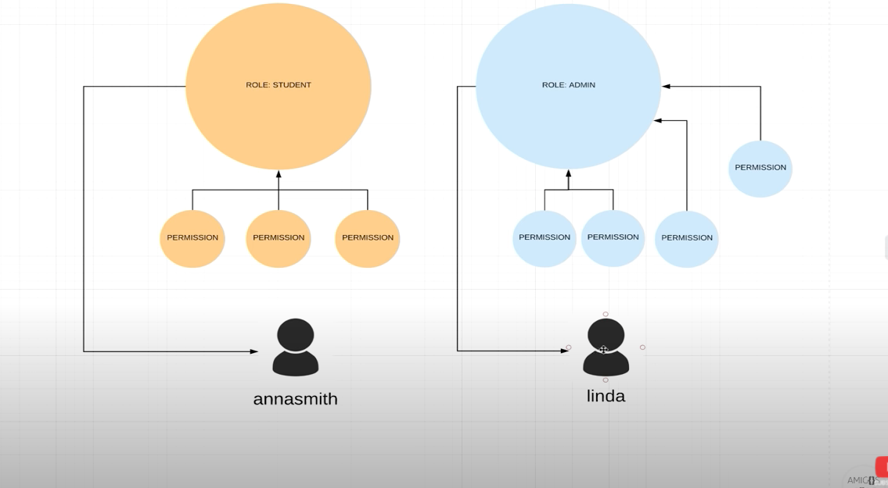

# Spring boot Maven Plugin 

## References 
*  Simple Introduction : https://www.javalopment.com/2019/04/configuring-spring-boot-application.html
*  Complete Reference : https://docs.spring.io/spring-boot/docs/current/maven-plugin/reference/htmlsingle/#?.?
*  https://www.youtube.com/watch?v=her_7pa0vrg


## Bare Minimum 
1. Autogenerated Log in page 
````
localhost:8080/login
````
2. Autogenerated log out page 
````
localhost:8080/logout
````


## Basic Authentication with SPring Boot


Basic auth needs to send credentials in every call; so it is best suited for external communication 

* with web browser you will see an input box for the credentials 
* this is not a good approach for application ; so application can pass the following header 
````
Authorize : Basic base64(username:password)
```` 
example value  `Basic dXNlcjphYmMxMjM=`

In Postman


## User Details Service
Allows define a user details service `UserDetailsService`. 
We need to a User with following properties 
* Username ( Must have )
* Encoded Password ( Must have )
* Roles ( Must have )
* authorities ( Optional but highly recommended )
* and more 

### InMemoryUserDetailManager 
`InMemoryUserDetailManager` is a `UserDetailService` 


### Roles
`Role` s comes with `Permission`

In this picture  `Admin` is a Role and there are 4 `Permissions` in it

Roles are Assigned to `Users`



## Enforcing API based Authentication 
We can enforce Role based authentication or Permission based authentication 


### Role based Authentication 
Only students can access URL which starts with `/api/`. Notice that we are using `hasRole`
````
 @Override
    protected void configure(HttpSecurity http) throws Exception {

	http.authorizeRequests() // Any request must be authenticates
		.antMatchers("/", "/index").permitAll() 
		.antMatchers("/api/**").hasRole(ApplicationUserRole.STUDENT.name())
		.anyRequest().authenticated().and().httpBasic(); // mechanism for authentication is basic

    }
    
````

### Permission Based Authetication 

We can enforce it in the configure nethod
We are using `hasAuthority()`


Markdown Ref: https://github.com/tchapi/markdown-cheatsheet/blob/master/README.md
